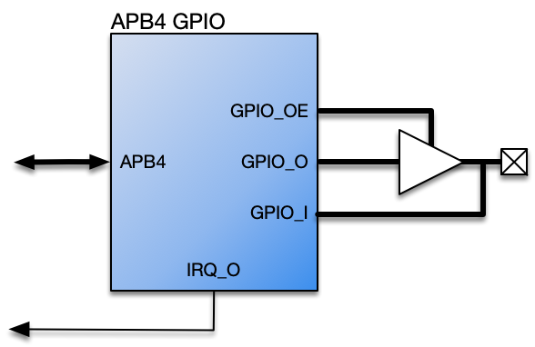

# APB4 General Purpose IO (GPIO)

The APB4 GPIO Core is fully parameterised core designed to provide a user-defined number of general purpose, bidirectional IO to a design.

The IO are accessible via an [AMBA APB v2.0 Specification](http://infocenter.arm.com/help/topic/com.arm.doc.ihi0024c/index.html)interface – typically referred to as APB4 – and the core operates synchronously with the rising edge of the APB4 Bus Clock..

Inputs to the core may operate asynchronously to the core and will be automatically synchronised to the bus clock. Outputs may be configured to operate in push-pull mode or open-drain

## Documentation
[Datasheet](DATASHEET.md)

- [PDF Format](docs/apb4_gpio_datasheet.pdf)

## Features

- Compliant with [AMBA APB v2.0 Specification](http://infocenter.arm.com/help/topic/com.arm.doc.ihi0024c/index.html)
- User-defined number of Bi-directional General Purpose IO
- Automatic synchronisation of General Inputs to Bus Clock
- Each General Output configurable as push-pull or open-drain

## Interfaces

- APB Slave Interface

## License

Released under the RoaLogic [Non-Commercial License](/LICENSE.md)

## Dependencies

This release requires the ahb3lite package found here https://github.com/RoaLogic/ahb3lite_pkg
